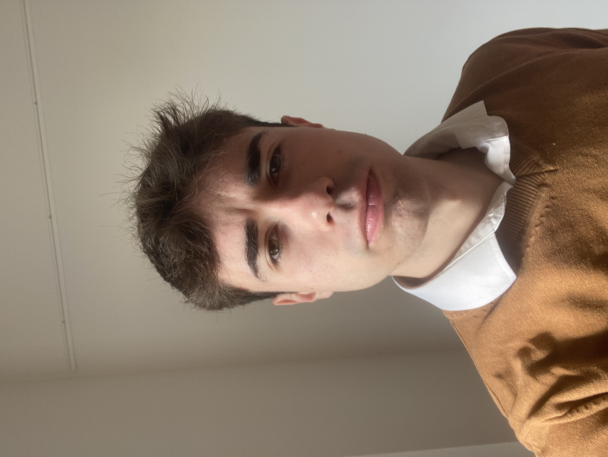

# A little bit about me

  
   <b>Hello, I'm Eric!</b> 
  I am a biotechnologist and (almost) a bioinformatician. I am Spanish and lived for most of my life in the small city of Azuqueca de Henares, not too far away from Madrid. Currently, I am living in Copenhagen, Denmark, where I am studying my MSc in Bioinformatics at DTU (among other things). 

  I am passionate of learning new things in general: from biology and bioinformatics to history, phylosophy, geography or sociology. I love reading and I always try to read something everyday. I also love cycling (luckily I live in the land of bikes 😜), hiking, cooking new recipes, learning new languages and travelling to new places. I find satisfaction in sharing knowledge with others.

# Where did I work in the past and what did I learn?
My very first formal job was as a lifeguard with 17 years old. As many other young boys at my age, I decided to sacrifice part of my summer vacations with the goal of earning some money that would allow me some financial self-sufficiency. Actually, my current cell phone (yes, I am that kind of people that use the cellphone for more than 5 years) was payed with the savings I got from summer 2020. 

Considering science, my first contact with real research (outside the practical classes from my Bachelor's degree) was at the Center for Biomedical Technology (Madrid, Spain). I was under the supervision of Dr. Carmen Ramírez Castillejo and the (at the time) PhD student Josefa Quiroz Troncoso. My tasks consisted mainly to extract compounds from freeze-dried fruits using solvents from green chemistry (specifically, Natural Deep Eutectic Solvents or NADES). Then, I quantified the antioxidant power of these compounds using DPPH assay. The aim of the data I generated with my experimental work was to later try some of these compounds in anti-cancer therapies. 

From this experience, I could say that I have learned a lot. Upmost, how to work independently in a lab. Until then, all my contact with pipettes, cells, compounds or reagents was limited to practical classes with a strong guidance and supervision and the precise instructions of a protocol. But this was the first time I had the chance to work on my own, to take decisions myself, to make mistakes and to solve them independently (at least in part). I was also very comfortable with the team of the lab, which I also realised is an important asset in every workplace. 

My second position was also in academia, this time at the Centre for Plant Biotechnology and Genomics (Madrid, Spain). I arrived here in the second year of my Bachelor's as part of the Summer School Program offered to students by the University. I joined a small group back then, led by Dr. Soledad (Sol) Sacristán Benayas, who was researching about endophytic fungi and specifically, *Colletotrichum tofieldiae*. I enjoyed my work there so much that, what was meant to last for only two weeks ended up in two years. After the Summer School, I was hired by Sol as a student assistant and later, I had the chance to be financially supported by different grants from the Technical University of Madrid and the Spanish Ministry for Education. My tasks were first focused in wet lab, with a strong agricultural focus: I even collected wheat samples inoculated with our fungus of interest in a small town of the province of Guadalajara to see if it the interaction plant-fungus had a positive effect in its growth. To be honest, I quite enjoyed it. But later on, I switch to dry lab and analysed the genome and transcriptome of the fungus, which was the topic of my Bachelor thesis.  

[to be expanded...]

# Bioinformatic tools 
I made a rather exhaustive work from the last five years to collect some of the computational biology/bioinformatic tools I used and have some kind of proficiency. The list might be incomplete and some of the programs are possibly obsolete now, but my plan is to improve it continually: 

* **Sequencing analysis & alignment**: BLAST, Clustal, MAFFT, Muscle, BWA, SAMtools. 
* **Genomics NGS tools**: STAR, FastQC, fastp, Trimmomatics, DESeq2, GATK, HTSeq, Bowtie2.
* **Systems Biology**: Cytoscape, STRING, ATTED-II, DAVID, MetaboAnalyst, ShinyGO, REViGO, ClusterProfiler.
* **Molecular visualization & structural bioinformatics**: PyMOL, Chimera, ElNémo, AutoDock, CABS-flex.
* **Molecular sequence analysis**: PatMatch, SignalP 6.0, DeepTMHMM, dbCAN3, EffectorP, T-REKS, antiSMASH, InterProScan, Pfam.
* **Genomic data exploration**: IGV.
* **Molecular evolution and phylogenetics**: MEGA, FigTree, jModelTest, PhyML, BEAST, BEAUTi, Tracer, MrBayes, TempEst, Mesquite, Datamonkey, SPREAD, RDP, TreeMap, PAUP*.
* **Others**: Simulink, NetLogo, Blender. 

# How to reach me
If you want to contact me, you can send me an email to torresgarciaeric@gmail.com

# Outreach and education
I am a humble student with much still to learn, but I have always loved teaching and sharing knowledge. In collaboration with the university association Integradxs Biotecnología at the National University of Moreno (Argentina), I prepared a free workshop for Biotechnology students on using Chimera for protein visualization and engineering. The session was recorded and is available to watch on YouTube [[Click here to watch (in Spanish)]](https://www.youtube.com/watch?v=cReQ7QjbXNo). 

<!--
**er-biotecazu/er-biotecazu** is a ✨ _special_ ✨ repository because its `README.md` (this file) appears on your GitHub profile.

Here are some ideas to get you started:

- 🔭 I’m currently working on ...
- 🌱 I’m currently learning ...
- 👯 I’m looking to collaborate on ...
- 🤔 I’m looking for help with ...
- 💬 Ask me about ...
- 📫 How to reach me: ...
- 😄 Pronouns: ...
- ⚡ Fun fact: ...
-->
